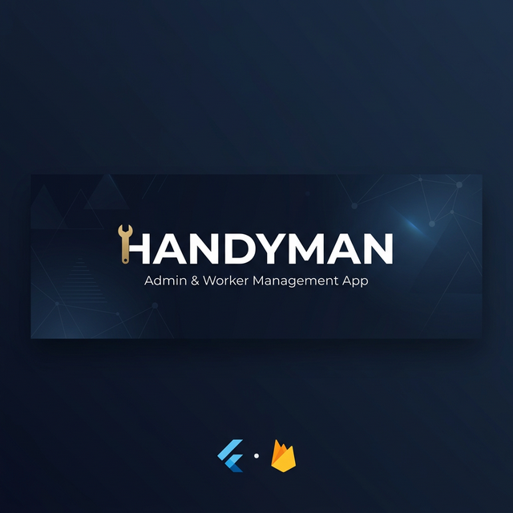

# 🔧 HANDYMAN: Admin & Worker Management System



<div align="center">

[](https://flutter.dev)
[](https://firebase.google.com)
[](https://dart.dev)
[](https://flutter.dev)
[](LICENSE)

**A professional, high-performance management ecosystem for Handyman services.**

[Features](#-key-features) • [Architecture](#-technical-architecture) • [Setup](#-getting-started) • [Screenshots](#-screenshots)

</div>

---

## 🚀 Overview

**HANDYMAN** is a dual-application ecosystem designed to streamline service management between administrators, service providers (workers), and customers. Built with **Flutter** and **Firebase**, it delivers real-time synchronization, offline capabilities, and a premium user experience.

---

## ✨ Key Features

### 🛡️ Administrator Panel
- **Comprehensive Dashboard:** Real-time analytics for revenue, active jobs, and worker performance.
- **Worker Management:** Onboard, monitor, and manage commission rates for service providers.
- **Financial Control:** Integrated VAT management, withdrawal request processing, and automated auditing.
- **Service Catalog:** Dynamic management of categories, sub-categories, and pricing models.
- **Customer Insights:** History-based customer management and interaction tracking.

### 👷 Worker Experience
- **Personalized Workspace:** Individual dashboards showing earnings, ratings, and job status.
- **Wallet & Credits:** Direct management of earnings with integrated credit request systems.
- **Job Lifecycle:** Seamless job acceptance, real-time status updates, and professional invoice generation.

### 🌐 Core Infrastructure
- **Real-time Sync:** Powered by Cloud Firestore for instantaneous data updates across devices.
- **Smart Notifications:** Deep-linked push notifications via Firebase Cloud Messaging (FCM).
- **Pro Invoicing:** Automated PDF generation with VAT compliance and professional branding.
- **Robust Connectivity:** Built-in network monitoring for graceful handling of offline states.

---

## 🏗️ Technical Architecture

The project follows a modular and scalable architecture:

```text
lib/
├── admin/          # Admin-specific UI & logic
├── worker/         # Worker-specific UI & logic
├── models/         # Strongly-typed data definitions
├── services/       # Core business logic & Firebase integration
├── providers/      # Centralized state management (Provider)
├── utils/          # Theming, translations, & helper functions
└── widgets/        # Atomized, reusable UI components
```

---

## 🛠️ Tech Stack

- **UI Framework:** [Flutter](https://flutter.dev) (v3.9.2+)
- **State Management:** [Provider](https://pub.dev/packages/provider)
- **Backend:** [Firebase](https://firebase.google.com) (Auth, Firestore, Storage, Messaging, Functions)
- **Local Storage:** [Shared Preferences](https://pub.dev/packages/shared_preferences)
- **Reporting:** [Firebase Analytics & Crashlytics](https://firebase.google.com/docs/analytics)

---

## 📦 Getting Started

### Prerequisites
- Flutter SDK `^3.9.2`
- Firebase Project setup
- Android Studio / VS Code

### Installation

1. **Clone & Navigate**
   ```bash
   git clone https://github.com/WaseeqSiddiqui/HANDYMAN_Admin_And_Worker_App.git
   cd HANDYMAN_Admin_And_Worker_App
   ```

2. **Sync Dependencies**
   ```bash
   flutter pub get
   ```

3. **Firebase Configuration**
   - Add `google-services.json` to `android/app/`
   - Add `GoogleService-Info.plist` to `ios/Runner/`
   - Run `flutterfire configure` to update `firebase_options.dart`

---

## 👥 Contributors

- **Waseeq Siddiqui** – Lead Architecture & Development
- **Eiman Fatima** – Core Contributor ([eimanfkhan18@gmail.com](mailto:eimanfkhan18@gmail.com))

---

<div align="center">
  <sub>Built with ❤️ by Waseeq Siddiqui. © 2026.</sub>
</div>
